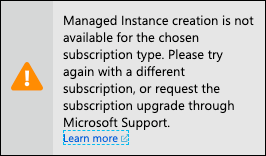
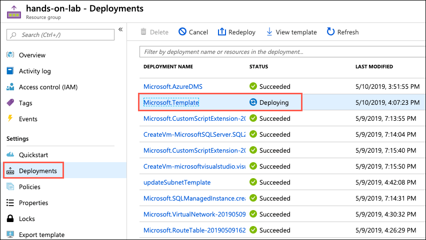

Migrating SQL databases to Azure

Before the hands-on lab setup guide

May 2019

Information in this document, including URL and other Internet Web site references, is subject to change without notice. Unless otherwise noted, the example companies, organizations, products, domain names, e-mail addresses, logos, people, places, and events depicted herein are fictitious, and no association with any real company, organization, product, domain name, e-mail address, logo, person, place or event is intended or should be inferred. Complying with all applicable copyright laws is the responsibility of the user. Without limiting the rights under copyright, no part of this document may be reproduced, stored in or introduced into a retrieval system, or transmitted in any form or by any means (electronic, mechanical, photocopying, recording, or otherwise), or for any purpose, without the express written permission of Microsoft Corporation.

Microsoft may have patents, patent applications, trademarks, copyrights, or other intellectual property rights covering subject matter in this document. Except as expressly provided in any written license agreement from Microsoft, the furnishing of this document does not give you any license to these patents, trademarks, copyrights, or other intellectual property.

The names of manufacturers, products, or URLs are provided for informational purposes only and Microsoft makes no representations and warranties, either expressed, implied, or statutory, regarding these manufacturers or the use of the products with any Microsoft technologies. The inclusion of a manufacturer or product does not imply endorsement of Microsoft of the manufacturer or product. Links may be provided to third party sites. Such sites are not under the control of Microsoft and Microsoft is not responsible for the contents of any linked site or any link contained in a linked site, or any changes or updates to such sites. Microsoft is not responsible for webcasting or any other form of transmission received from any linked site. Microsoft is providing these links to you only as a convenience, and the inclusion of any link does not imply endorsement of Microsoft of the site or the products contained therein.

© 2019 Microsoft Corporation. All rights reserved.

Microsoft and the trademarks listed at <https://www.microsoft.com/en-us/legal/intellectualproperty/Trademarks/Usage/General.aspx> are trademarks of the Microsoft group of companies. All other trademarks are property of their respective owners.

**Contents**

<!-- TOC -->

- [Migrating SQL databases to Azure before the hands-on lab setup guide](#migrating-sql-databases-to-azure-before-the-hands-on-lab-setup-guide)
  - [Requirements](#requirements)
  - [Before the hands-on lab](#before-the-hands-on-lab)
    - [Task 1: Provision a resource group](#task-1-provision-a-resource-group)
    - [Task 2: Register the Microsoft DataMigration resource provider](#task-2-register-the-microsoft-datamigration-resource-provider)
    - [Task 3: Run ARM template to provision lab resources](#task-3-run-arm-template-to-provision-lab-resources)

<!-- /TOC -->

# Migrating SQL databases to Azure before the hands-on lab setup guide

## Requirements

1. Microsoft Azure subscription must be pay-as-you-go or MSDN.
   - Trial subscriptions will *not* work.
   - Rights to create an Azure Active Directory application and service principal and assign roles on your subscription.

## Before the hands-on lab

Duration: 30 minutes

In this exercise, you will set up your environment for use in the rest of the hands-on lab. You should follow all steps provided *before* attending the Hands-on lab.

> **IMPORTANT**: Many Azure resources require unique names. Throughout these steps you will see the word "SUFFIX" as part of resource names. You should replace this with your Microsoft alias, initials, or another value to ensure resources are uniquely named.

### Task 1: Provision a resource group

In this task, you will create an Azure resource group which will serve as a container for the resources used throughout this lab.

1. In the [Azure portal](https://portal.azure.com), select **Resource groups**, select **+Add**, then enter the following in the Create an empty resource group blade:

    - **Subscription**: Select the subscription you are using for this hands-on lab.
    - **Resource group**: Enter hands-on-lab-SUFFIX.
    - **Region**: Select the region you would like to use for resources in this hands-on lab. Remember this location so you can use it for the other resources you'll provision throughout this lab.

    

2. Select **Review + Create**.

3. On the Review + Create tab, select **Create** to provision the resource group.

### Task 2: Register the Microsoft DataMigration resource provider

In this task, you will register the `Microsoft.DataMigration` resource provider with your subscription in Azure.

1. In the [Azure portal](https://portal.azure.com), select **All services** from the Azure navigation pane, and then select **Subscriptions**.

    

2. Select the subscription you are using for this hands-on lab from the list, select **Resource providers**, enter "migration" into the filter box, and then select **Register** next to **Microsoft.DataMigration**.

    

3. It can take a couple of minutes for the registration to complete. Make sure you see a status of **Registered** before moving on.

    

### Task 3: Run ARM template to provision lab resources

In this task, you will run an Azure Resource Manager (ARM) template to deploy the resources required for this hands-on lab. The components will be deployed inside a new virtual network (VNet) to facilitate communication between the VMs and SQL MI. The ARM template also adds inbound and outbound security rules to the network security groups associated with SQL MI and the VMs, including opening port 3389 to allow RDP connections to the JumpBox. In addition to the provisioning of resources, the ARM template will also execute PowerShell scripts on each of the VMs to install software and configure the servers. The resources created by the ARM template include:

- A virtual network with three subnets, ManagedInstance, Management, and a Gateway subnet
- A virtual network gateway, associated with the Gateway subnet
- A route table
- Azure SQL Database Managed Instance (SQL MI), added to the ManagedInstance subnet
- A JumpBox with Visual Studio 2019 Community edition and SQL Server Management Studio (SSMS installed, added to the Management subnet
- A SQL Server 2008 R2 VM with the Data Migration Assistant (DMA) installed, added to the Management subnet
- Azure Database Migration Service (DMS)
- Azure App Service Plan and App Service (Web App)
- Azure Blob Storage account

> You can review the steps to manually provision the lab resources in [Appendix A](./Appendix-A).

1. Before running the ARM template, it is beneficial to quickly verify that you will be able to provision SQL MI in your subscription. In the [Azure portal](https://portal.azure.com), select **+Create a resource**, enter "sql managed instance" into the Search the Marketplace box, and then select **Azure SQL Managed Instance** from the results.

    

2. Select **Create** on the Azure SQL Managed Instance blade.

    

3. On the SQL managed instance blade, look for a message stating that "Managed instance creation is not available for the chosen subscription type...", which will be displayed near the bottom of the SQL managed instance blade.

    

    > **NOTE**: If you see the message stating that Managed Instance creation is not available for the chosen subscription type, follow the instructions for [obtaining a larger quota for SQL Managed Instance](https://docs.microsoft.com/en-us/azure/sql-database/sql-database-managed-instance-resource-limits#obtaining-a-larger-quota-for-sql-managed-instance) before proceeding with the following steps.

4. You are now ready to begin the ARM template deployment. To open a custom deployment screen in the Azure portal select the Deploy to Azure button below:

    

5. On the custom deployment screen in the Azure portal, enter the following:

    - **Subscription**: Select the subscription you are using for this hands-on lab.
    - **Resource group**: Select the hands-on-lab-SUFFIX resource group from the dropdown list.
    - **Location**: Select the location you used for the hands-on-lab-SUFFIX resource group.
    - **Managed Instance Name**: Accept the default value, **sqlmi**. **NOTE**: The actual name must be globally unique, so a unique string will be generated from your Resource Group and appended to the name during provisioning.
    - **Admin Username**: Accept the default value, **sqlmiuser**.
    - **Admin Password**: Accept the default value, **Password.1234567890**.
    - **V Cores**: Accept the default value, **16**.
    - **Storage Size in GB**: Accept the default value, **32**.
    - Check the box to agree to the Azure Marketplace terms and conditions.

    

6. Select **Purchase** to start provisioning the JumpBox VM and SQL Managed Instance.

    > **NOTE**: The deployment of the custom ARM template can take over 6 hours due to the inclusion of SQL MI. However, the deployment of most of the resources will complete within a few minutes. The JumpBox and SQL Server 2008 R2 VMs should complete in about 15 minutes.

7. You can monitor the progress of the deployment by navigating to the hands-on-lab-SUFFIX resource group in the Azure portal, and then selecting **Deployments** from the left-hand menu. The deployment will be named **Microsoft.Template**. Select that to view the progress of each item in the template.

    

> You have now completed the before the hands-on lab. Check back in a few hours to monitor the progress of your SQL MI provisioning. If the provisioning goes on for longer than 7 hours, you may need to issue a support ticket in the Azure portal to request the provisioning process be unblocked by Microsoft support.

You should follow all steps provided *before* attending the Hands-on lab.
